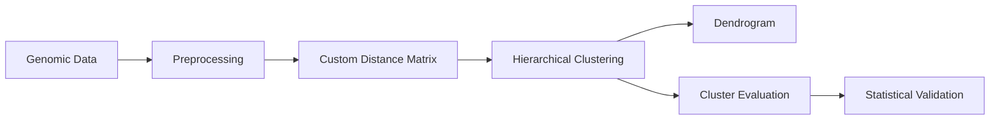

# 🧬 Hierarchical Clustering for Genomic Data with Custom Distance Metrics

**Data Mining & Warehousing — CA-2**
**Author:** Anusha Jayakumar Panicker

[](https://colab.research.google.com/github/Anusha-Panicker/Hierarchical-Clustering-Genomic-Data-Custom-Distance-Metrics/blob/main/DMW_CA2_Genomic_Hierarchical_Clustering.ipynb)

An end-to-end **genomic clustering pipeline built entirely from scratch** using NumPy and pandas. The project applies hierarchical clustering to two different genomic data types — **gene expression** and **SNP genotypes** — using custom domain-specific distance metrics and evaluates the resulting clusters using internal, external, and permutation-based analysis.

---

## 🚀 Highlights

* 🧬 **Two genomic data types:** Gene expression and SNP genotype data
* 📐 **Custom distance metrics:** Pearson, Hamming, Manhattan and Euclidean
* 🌳 **Hierarchical clustering:** Single, Complete and Average linkage
* 🛠️ **Built completely from scratch:** No scikit-learn, SciPy or ML libraries
* 📊 **Cluster evaluation:** Silhouette score, Cophenetic correlation and ARI
* 🔬 **Statistical validation:** Permutation tests for cluster-label associations
* ✅ **Correctness checks:** Small hand-verified examples for distances, linkage and evaluation metrics
* 🧹 **Genomic preprocessing:** Feature selection, normalization and removal of related SNP samples

---

## 🧠 Project Pipeline



### Gene Expression

**GSE2034 → log2 transformation → top 500 genes → gene-wise centering → Pearson / Euclidean distance → hierarchical clustering**

### SNP Genotypes

**VCF files → 0/1/2 genotype encoding → remove related samples → Hamming / Manhattan / Euclidean distance → hierarchical clustering**

---

## 📂 Datasets

| Dataset                   | Source                                                                 | Size / Groups              | Purpose                                    |
| ------------------------- | ---------------------------------------------------------------------- | -------------------------- | ------------------------------------------ |
| **GSE2034 Breast Cancer** | [NCBI GEO](https://www.ncbi.nlm.nih.gov/geo/query/acc.cgi?acc=GSE2034) | 286 samples, 22,283 probes | Pearson vs Euclidean clustering            |
| **SNP Genotypes**         | Thermo Fisher Axiom Exome dataset                                      | CEU, CHB, YRI              | Hamming / Manhattan / Euclidean clustering |

Clinical labels and population labels are used **only for evaluation**, not for constructing the clusters.

---

## ⚙️ What Is Implemented From Scratch?

| Component                | Purpose                                                                 |
| ------------------------ | ----------------------------------------------------------------------- |
| `GenomicPreprocessor`    | Log transformation, feature selection and gene-wise centering           |
| `PearsonDistance`        | Correlation-based distance: `1 − Pearson correlation`                   |
| `GenotypeDistance`       | Hamming and Manhattan distances with missing-value handling             |
| `EuclideanDistance`      | Euclidean baseline for comparison                                       |
| `RankTransformer`        | Rank-transformed Euclidean baseline                                     |
| `HierarchicalClustering` | Agglomerative clustering with 3 linkage strategies                      |
| `DendrogramPlotter`      | Custom dendrogram generation                                            |
| `SilhouetteEvaluator`    | Silhouette score from a distance matrix                                 |
| `CopheneticEvaluator`    | Measures how well the dendrogram preserves original distances           |
| `ARIEvaluator`           | Adjusted Rand Index, purity and contingency tables                      |
| `Permutation Tests`      | Tests whether observed cluster-label associations could occur by chance |

The clustering engine follows an object-oriented design with:

```python
.fit(D)
.predict(k)
```

---

## 📊 Key Results

### 🧬 GSE2034 — Gene Expression

**Average linkage | 500 genes | k = 2**

| Distance  | Cophenetic | Best Silhouette | Cluster Sizes |
| --------- | ---------: | --------------: | ------------: |
| Pearson   |      ~0.71 |           ~0.19 |     100 / 186 |
| Euclidean |      ~0.71 |           ~0.15 |      238 / 48 |

Pearson distance produced a more balanced clustering structure. The resulting clusters also showed different bone-relapse rates, with permutation testing indicating that the observed difference was unlikely to be explained by random label assignment.

> **Important:** This is an association analysis, not a prediction model. The overall silhouette scores are low, indicating that the underlying cluster structure is relatively weak.

### 🧬 SNP Genotypes

Manhattan and Euclidean distances separated the **CEU, CHB and YRI populations** very strongly, while Hamming distance produced weaker separation.

Because these populations represent geographically distinct groups, this result primarily demonstrates that the clustering pipeline and distance metrics work as expected on structured genomic data.

---

## 🔍 Why Custom Distance Metrics?

Different genomic data types have different notions of similarity.

* **Pearson distance** captures similarity in gene-expression patterns rather than absolute expression magnitude.
* **Hamming distance** measures genotype mismatches.
* **Manhattan distance** captures the total absolute difference between genotype values.
* **Euclidean distance** provides a common baseline for comparison.

This allows the same hierarchical clustering engine to be evaluated under different domain-specific definitions of genomic similarity.

---

## ⚠️ Limitations

* Silhouette and cophenetic scores are calculated within each distance space, so cross-metric comparisons should be interpreted carefully.
* **Single linkage** can produce chaining effects and unstable cluster sizes.
* The choice of **500 genes** is a configurable experimental setting, not a biological discovery.
* SNP population labels are used only for evaluation.
* The NumPy implementation is intentionally from scratch and can be slower than optimized scientific libraries on very large datasets.

---

## 🛠️ Technologies

**Python · NumPy · pandas · Matplotlib · Seaborn · Google Colab**

### Constraints

This project intentionally avoids ready-made machine learning implementations.

**Used:**

* NumPy
* pandas
* Matplotlib
* Seaborn
* Python standard library (`os`, `time`, `gzip`, `zipfile`, `urllib`)

**Not used:**

* ❌ scikit-learn
* ❌ SciPy
* ❌ statsmodels
* ❌ Other ML/clustering libraries

---

## ▶️ How to Run

### Option 1 — Google Colab

Click the badge at the top of this README and run:

**Runtime → Run all**

### Option 2 — Run Locally

Clone the repository and open the notebook:

```bash
git clone https://github.com/Anusha-Panicker/Hierarchical-Clustering-Genomic-Data-Custom-Distance-Metrics.git
cd Hierarchical-Clustering-Genomic-Data-Custom-Distance-Metrics
```

The notebook downloads the required datasets automatically. If a source link becomes unavailable, the corresponding files can be downloaded manually from the original sources and uploaded to the notebook environment.

---

## 📚 References

* de Souto et al. (2008). *Clustering cancer gene expression data: a comparative study.* BMC Bioinformatics, 9:497.
* Lopez et al. (2018). *An unsupervised machine learning method for discovering patient clusters based on genetic signatures.* Journal of Biomedical Informatics, 85:30–39.
* Gribov et al. (2010). *SEURAT: Visual analytics for the integrated analysis of microarray data.* BMC Medical Genomics, 3:21.

---

### 👩‍💻 Author

**Anusha Jayakumar Panicker**
B.Tech — Artificial Intelligence & Machine Learning

🔗 [GitHub](https://github.com/Anusha-Panicker)
